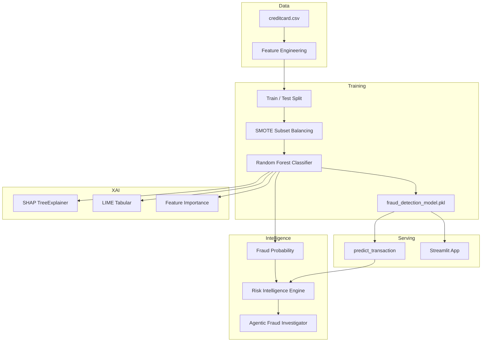
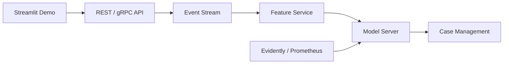

# Design Document: AI-Powered Real-Time Financial Fraud & Risk Intelligence Platform

**Team 5** · AAI-540 MLOps · Financial Fraud Detection

---

## 1. Overview

This platform detects fraudulent credit-card transactions in near real time, scores risk, and surfaces human-readable investigation guidance. It is implemented in the Jupyter notebook [`jupyter_notebook/Team_5_AI_Powered_Real_Time_Financial_Fraud_&_Risk_Intelligence_Platform.ipynb`](jupyter_notebook/Team_5_AI_Powered_Real_Time_Financial_Fraud_&_Risk_Intelligence_Platform.ipynb) and targets resource-constrained environments (laptops, Colab) while preserving production-oriented patterns: imbalance handling, explainability, and a Streamlit deployment path.

**Feature Store (SageMaker):** [`jupyter_notebook/Team_5_FeatureStore_CreditCard_Fraud.ipynb`](jupyter_notebook/Team_5_FeatureStore_CreditCard_Fraud.ipynb) — aligned with Assignment 3.1 Feature Store patterns; ingests `creditcard.csv` into online/offline feature groups for real-time inference enrichment.

### 1.1 Problem statement

Credit-card fraud is rare (~0.17% of transactions) but costly. A practical system must:

- Maximize **recall** (catch fraud) without ignoring precision entirely
- Operate on **anonymized** PCA features (privacy-preserving dataset)
- Support **analyst trust** via explainable AI (XAI)
- Provide **actionable** risk tiers and investigation prompts

### 1.2 Design goals

| Goal | Approach |
|------|----------|
| High fraud sensitivity | SMOTE on training subset + Random Forest with class imbalance awareness |
| Interpretability | SHAP (global), LIME (local), feature importance |
| Operational scoring | `predict_transaction()` + risk engine thresholds |
| Analyst workflow | Agentic fraud investigator (rule-based recommendations) |
| Deployability | Serialized model (`fraud_detection_model.pkl`) + Streamlit `app.py` |

### 1.3 Non-goals (current scope)

- Live payment-gateway integration or sub-100ms streaming inference
- Production MLOps (model registry, drift monitoring, A/B tests)
- Deep learning / graph-based fraud networks
- Multi-tenant auth, audit logging, or PCI-DSS certification

---

## 2. System architecture

### 2.1 High-level components



### 2.2 Processing pipeline (notebook sections)

| Step | Section | Output |
|------|---------|--------|
| 1 | Project setup & libraries | Dependencies installed |
| 2 | Load data | 284,807 × 31 records |
| 3–4 | EDA & visualization | Class imbalance (~0.17% fraud) |
| 6 | Feature engineering | `Amount_Log`, `Hour` |
| 7–9 | Split, scale, train/test | X: 32 features; 80/20 split |
| 10 | SMOTE (50k subset) | Balanced minority class |
| 11–13 | Train RF, predict, evaluate | Metrics + reports |
| 14–16 | Confusion matrix, ROC, PR curves | Visual validation |
| 17–18 | Risk engine + investigator | Tiered alerts |
| 19–21 | SHAP, LIME, importance | XAI artifacts |
| 22–24 | Save model, real-time fn, Streamlit | Deployment assets |
| 25 | Final summary | System checklist |

---

## 3. Data design

### 3.1 Source dataset

**European credit card fraud dataset** (Kaggle: *Credit Card Fraud Detection*), loaded as `creditcard.csv`.

| Column | Description |
|--------|-------------|
| `Time` | Seconds elapsed since first transaction |
| `V1`–`V28` | PCA-transformed, anonymized features |
| `Amount` | Transaction amount |
| `Class` | Label: `0` = legitimate, `1` = fraud |

**Privacy note:** Original sensitive attributes are not present; PCA preserves fraud signal while supporting compliance-friendly modeling.

### 3.2 Dataset statistics

- **Rows:** 284,807  
- **Fraud rate:** ~0.1727%  
- **Raw columns:** 31 → **model features:** 32 (after engineering)

### 3.3 Engineered features

| Feature | Formula / logic | Rationale |
|---------|-----------------|-----------|
| `Amount_Log` | `log1p(Amount)` | Reduces skew in transaction amounts |
| `Hour` | `(Time // 3600) % 24` | Captures time-of-day fraud patterns |

### 3.4 Memory optimizations

- `float32` dtypes for numeric columns where applicable  
- SMOTE applied on a **50,000-row training subset** (not full train set)  
- SHAP/LIME run on **samples** (100 / 5,000 rows) for laptop feasibility  

---

## 4. Machine learning design

### 4.1 Preprocessing

1. **Feature matrix `X`:** all columns except `Class` (32 features).  
2. **Scaling:** `StandardScaler` on `Amount`, `Time`, `Amount_Log` only (PCA features left as-is).  
3. **Split:** 80% train / 20% test, stratified by `Class` (`random_state=42`).

### 4.2 Class imbalance strategy

**Problem:** ~492 fraud vs ~284,315 legitimate transactions.

**Strategy:**

1. **SMOTE** (`imblearn.over_sampling.SMOTE`) on 50,000 training rows → ~49,909 per class after resampling.  
2. **Random Forest** trained on balanced SMOTE data (implicitly favors minority recall).  
3. **Evaluation** on **unmodified** test set (no SMOTE on test—avoids leakage).

*Alternative considered in notebook:* `SGDClassifier` with `class_weight='balanced'` for lightweight training; primary production model is Random Forest.

### 4.3 Model specification

**Primary classifier:** `RandomForestClassifier`

```python
RandomForestClassifier(
    n_estimators=100,
    max_depth=10,
    random_state=42,
    n_jobs=-1,
)
```

**Artifact:** `joblib.dump(rf_model, "fraud_detection_model.pkl")`

### 4.4 Evaluation metrics (hold-out test)

| Metric | Value | Notes |
|--------|-------|-------|
| Accuracy | 99.86% | Dominated by majority class |
| Precision (fraud) | 56.43% | Trade-off for high recall |
| Recall (fraud) | 80.61% | Primary success metric |
| F1 (fraud) | 66.39% | Balance metric |
| ROC-AUC | 95.32% | Strong ranking ability |

**Design interpretation:** In fraud operations, **missing fraud (false negative)** is often costlier than extra alerts (false positive). The model prioritizes recall while maintaining usable ROC-AUC.

### 4.5 Confusion matrix & curves

- **Confusion matrix:** visual FP/FN trade-off on test set  
- **ROC curve:** AUC ≈ 0.953  
- **Precision–recall curve:** guides threshold tuning for production  

---

## 5. Risk intelligence layer

### 5.1 Fraud probability scoring

For each transaction, the model outputs `P(fraud) = predict_proba[:, 1]`.

### 5.2 Risk Intelligence Engine

Rule-based tiering on fraud probability:

| Probability | Risk level |
|-------------|------------|
| ≥ 0.80 | `CRITICAL FRAUD RISK` |
| ≥ 0.70 | `HIGH FRAUD RISK` |
| ≥ 0.40 | `MODERATE RISK` |
| &lt; 0.40 | `LOW RISK` |

### 5.3 Agentic AI Fraud Investigator

Maps probability + transaction amount to **actionable text** (not an LLM—a deterministic policy layer for demo and analyst UX):

| Condition | Recommended action |
|-----------|-------------------|
| P ≥ 0.80 | High-priority alert; freeze account; escalate to fraud team |
| P ≥ 0.70 | Moderate alert; step-up authentication |
| Else | Low risk; continue monitoring |

This layer bridges ML output and business workflows (SOC playbooks, case management).

### 5.4 Real-time prediction API (in-notebook)

```python
def predict_transaction(transaction):
    # Returns: Prediction, Fraud Probability, Risk Level
```

Input: 32-dimensional feature vector (same order as training).  
Output: binary label, probability, and risk tier.

---

## 6. Explainable AI (XAI)

### 6.1 SHAP (global)

- **Explainer:** `shap.TreeExplainer` on a lightweight RF (20 trees, depth 5) for speed  
- **Sample:** 100 test transactions  
- **Insight:** Top contributors include `V14`, `V3`, `V12`, `V17`, `V5`

### 6.2 LIME (local)

- **Explainer:** `LimeTabularExplainer` on 5,000 training samples  
- **Use case:** Per-transaction explanations (e.g., `V16`, `Hour > 19`, `V5`)

### 6.3 Feature importance

Coefficient magnitudes from linear model analysis in notebook; top signals: `V10`, `V16`, `V4`, `V17`, `Time`.

**Regulatory value:** Supports model documentation, analyst review, and audit responses (why was this transaction flagged?).

---

## 7. Deployment design

### 7.1 Artifacts

| File | Purpose |
|------|---------|
| `fraud_detection_model.pkl` | Trained Random Forest |
| `creditcard.csv` | Dataset for Streamlit demo sampling |
| `app.py` | Streamlit UI (generated in notebook) |

### 7.2 Streamlit application

**Capabilities:**

- Load cached model and balanced sample of transactions (20 fraud + 20 legitimate)  
- Slider to select a transaction  
- Recompute `Amount_Log` and `Hour` at inference time  
- Display prediction, probability, and risk messaging  

**Run:**

```bash
pip install streamlit pandas numpy scikit-learn joblib
streamlit run app.py
```

*Note:* Run from the directory containing `fraud_detection_model.pkl` and `creditcard.csv` (paths as produced by the notebook).

### 7.3 Production evolution (recommended)



---

## 8. Technology stack

| Layer | Technologies |
|-------|----------------|
| Language | Python 3.x |
| Data | pandas, numpy |
| ML | scikit-learn, imbalanced-learn |
| XAI | SHAP, LIME |
| Viz | matplotlib, seaborn |
| UI | Streamlit |
| Serialization | joblib |

---

## 9. Security & compliance considerations

- Training data is **already anonymized** (PCA features).  
- No PII should be committed to the repository.  
- Production deployments require encryption in transit/at rest, access controls, and retention policies—not in current notebook scope.  
- Model decisions should be logged with SHAP/LIME snapshots for disputed transactions.

---

## 10. Known limitations

1. **Precision (~56%)** — many false positives; threshold tuning required per business cost model.  
2. **SMOTE on subset** — may not represent full data distribution.  
3. **Hour feature mismatch risk** — training uses `(Time // 3600) % 24`; Streamlit demo uses `Time / 3600` — align before production.  
4. **No online learning** — model is batch-trained; concept drift unaddressed.  
5. **Single-model** — no ensemble with XGBoost/LightGBM yet.

---

## 11. Future enhancements

- Threshold optimization on validation set (maximize F1 or cost-weighted metric)  
- Ensemble models (XGBoost / LightGBM)  
- Anomaly detection for zero-day fraud patterns  
- Feature store + real-time ingestion (Kafka, Flink)  
- MLOps: MLflow tracking, CI/CD, model monitoring & drift alerts  
- Hybrid deep learning (autoencoders on transaction sequences)  
- LLM-based investigator (replace rule templates with RAG over case history)

---

## 12. Repository layout

```
financial_fraud_detection/
├── DESIGN.md                          # This document
├── AI Fraud Detection Platform.pdf    # Supplementary reference
└── jupyter_notebook/
    └── Team_5_AI_Powered_Real_Time_Financial_Fraud_&_Risk_Intelligence_Platform.ipynb
```

---

## 13. References

- [Credit Card Fraud Detection (Kaggle)](https://www.kaggle.com/datasets/mlg-ulb/creditcardfraud)  
- Notebook: `Team_5_AI_Powered_Real_Time_Financial_Fraud_&_Risk_Intelligence_Platform.ipynb`  
- Course: AAI-540 MLOps, Team 5

---

*Document version: 1.0 · Aligned with notebook implementation (25 pipeline sections)*
